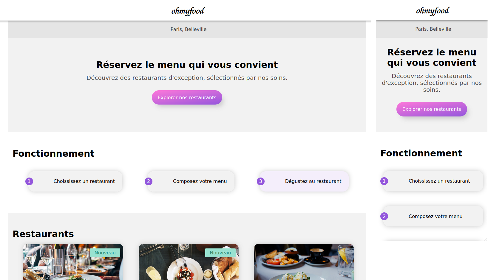

# ohmyfood
English version below!

Troisième projet du parcours "Développeur web" chez OpenClassroom. L'objectif d'intégrer puis de dynamiser une page web avec des animations CSS en utilisant le préprocesseur Sass

Vous pouvez retrouver le [brief complet ici](https://s3-eu-west-1.amazonaws.com/course.oc-static.com/projects/DW_P3/Brief%20cre%CC%81atif%20-%20Ohmyfood!.pdf)

**BUTS DU PROJET**:

- Créer un site web avec des animations

**Liens utiles**

- [site web / Website 🌎](https://benjaminlesne.github.io/benjaminLesne_3_03102021/)
- [Source Code 📖](https://github.com/BenjaminLesne/BenjaminLesne_13_05122021)

### Animation

**Boutons**

- Au survol, la couleur de fond des boutons principaux devra légèrement s’éclaircir. L’ombre portée devra également être plus visible.
- À terme, les visiteurs pourront sauvegarder leurs menus préférés. Pour ça, unbouton "J’aime" en forme de cœur est présent sur la maquette. Au clic, il devra se remplir progressivement. Pour cette première version, l’effet peut être apparaître au survol au lieu du clic.

**Page d’accueil**

- Quand l’application aura plus de menus, un “loading spinner” sera nécessaire. Sur cette maquette, nous souhaitons en avoir un aperçu. Il devra apparaître pendant 1 à 3 secondes quand on arrive sur la page d'accueil, couvrir l'intégralité de l'écran, et utiliser les animations CSS (pas de librairie). Le design de ce loader n’est pas défini,toute proposition est donc la bienvenue tant qu’elle est cohérente avec la chartegraphique du site.

**Pages de menu**
- À l’arrivée sur la page, les plats devront apparaître progressivement avec un léger décalage dans le temps. Ils pourront soit apparaître un par un, soit par groupe “Entrée”, “Plat” et “Dessert”. Un exemple de l’effet attendu est fourni.
- Le visiteur peut ajouter les plats qu'il souhaite à sa commande en cliquant dessus. Cela fait apparaître une petite coche à droite du plat. Cette coche devra coulisser dela droite vers la gauche. Pour cette première version, l’effet peut apparaître au survolau lieu du clic. Si l’intitulé du plat est trop long, il devra être rogné avec des points de suspension. Un exemple de l’effet attendu est fourni

## Technologies

**Autorisés:** HTML / CSS / Sass

**Recommandée:** HTML / Sass

**Interdit:** Javascript / Frameworks CSS / Inline CSS

**Contraintes :**
- Approche mobile-first: oui
- Maquette mobile : oui
- Maquette desktop : à improviser
- Validation W3C HTML : à passer, warning autorisés
- Validation W3C CSS : à passer, warning autorisés
- Compatibilité : Chrome, Firefox

## Installation

- Clone this repository
- Open the index.html with the VS code extension live server
- Enjoy the website on localhost:3000 (default)

## License

This project is part of the OpenClassrooms [Front-End Developer](https://openclassrooms.com/fr/paths/314-developpeur-front-end) course. The code is freely reusable, but the images / logo / figma mock-up do not belong to me.

If you are also an OC student, you can freely draw inspiration from my work, but I obviously do not recommend copying parts of it.

